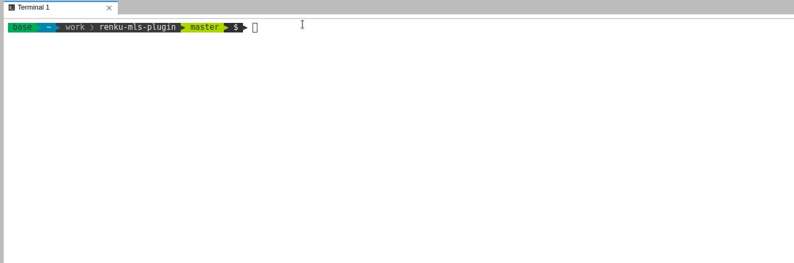

# Renku MLS (machine learning schema) plug-in

Many popular machine learning packages out there, for example `scikit-learn`
or `keras` have user-friendly interfaces in Python (or other languages).

When you need to test out several models and metrics at the same time, code
repetition and unnecessary verbosity sometimes creeps in to your projects.

The Renku MLS plug-in is designed to help you benchmark your machine learning
models easier, all whilst interfacing with the standard Renku command-line.

At present, the plug-in is compatible with `keras`, `scikit-learn` and `XGBoost`
with classification tasks and the following metrics: `accuracy_score`,
`roc_auc_score` and `f1_score`.

## Demo

To try it live, [launch a session from an example
project](https://renkulab.io/projects/learn-renku/renku-mls-plugin/sessions/new?autostart=1)
on renkulab.io.
