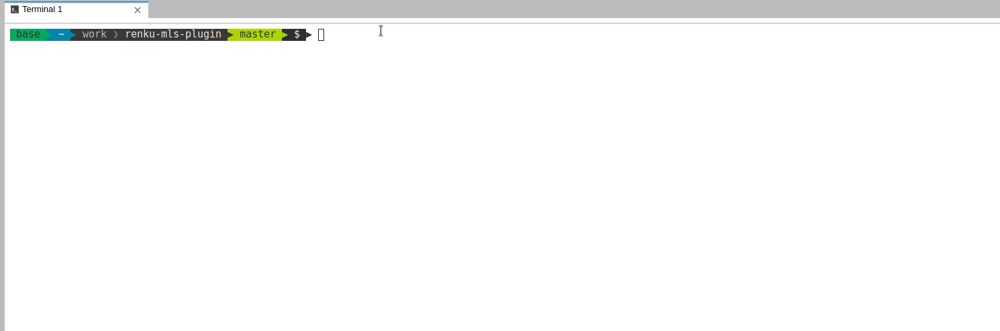

..
    Copyright 2017-2021 - Swiss Data Science Center (SDSC)
    A partnership between École Polytechnique Fédérale de Lausanne (EPFL) and
    Eidgenössische Technische Hochschule Zürich (ETHZ).

    Licensed under the Apache License, Version 2.0 (the "License");
    you may not use this file except in compliance with the License.
    You may obtain a copy of the License at

        http://www.apache.org/licenses/LICENSE-2.0

    Unless required by applicable law or agreed to in writing, software
    distributed under the License is distributed on an "AS IS" BASIS,
    WITHOUT WARRANTIES OR CONDITIONS OF ANY KIND, either express or implied.
    See the License for the specific language governing permissions and
    limitations under the License.

.. image:: https://renkulab.io/renku-badge.svg
    :target: https://renkulab.io/projects/learn-renku/plugins/renku-mls-plugin/sessions/new?autostart=1
    :alt: launch demo

.. image:: https://readthedocs.org/projects/renku-mls/badge/?version=latest&style=flat
    :target: https://renku-mls.readthedocs.org
    :alt: docs

Renku-MLS plugin
================

Renku MLS is a renku plugin for machine learning models. Using Renku MLS
one can expose the machine learning models used in renku projects (e.g.
hyper-parameters, evaluation metrics etc.).

Start by creating a Renku project, for details see the renku_ documentation.

.. _renku: https://renku-python.readthedocs.io/en/latest/gettingstarted.html#getting-started

Getting started
---------------
.. _gettingstarted-reference:

In the project make sure that the machine learning models (e.g. scikit-learn,
keras, xgboost etc) are exported using mlschema-model-converters_ plugin.

.. _mlschema-model-converters: https://pypi.org/project/mlschema-converters/

.. code-block:: python

    from xgboost import XGBClassifier
    from mlsconverters import export

    # model creation
    model = XGBClassifier()
    model.fit(X_train, y_train)

    # model eval
    y_pred = model.predict(X_test)
    acc = accuracy_score(y_test, y_pred)

    export(model, evaluation_measure=(accuracy_score, acc))

The `export` function persists the metadata about the model in Renku's knowledge
graph.

CLI Commands
------------

The Renku MLS plugin provides a few convenient CLI commands that query
the knowledge graph for machine learning models in a Renku project.

Leaderboard
^^^^^^^^^^^

`renku mls leaderboard` provides a quick overview of the machine learning models
used in the project:

.. code-block:: console

   $ renku mls leaderboard

The output of this command is a sorted list of models used and exposed in the project to renku.
The list is sorted by descending order of the provided evaluation measure (by default accuracy).
Moreover, it will provide information of the type of model that was used as well as the input
of those models.

Hyper-Parameters
^^^^^^^^^^^^^^^^

`renku mls params` provides the hyper-parameter settings of a specific ML model in the project.
If no `run-id` is provided, hyper-paramaters of all the models in project will be listed.

.. code-block:: console

   $ renku mls params

Demo
----

To try it live, `launch a session from an example project <https://renkulab.io/projects/learn-renku/plugins/renku-mls-plugin/sessions/new?autostart=1>`_ on renkulab.io.
